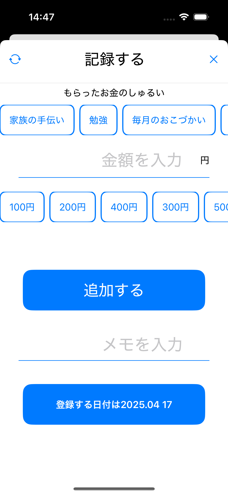
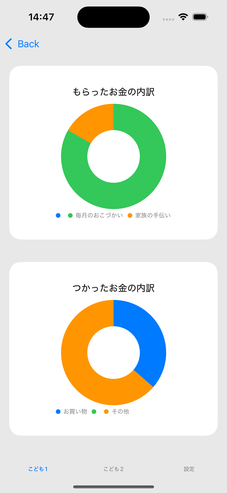

複数人の子どものお小遣いを管理するためのiOSアプリ
好きな名前をつけられる
名前の分だけタブ画面が追加される

子供が使いやすいようにおこづかいの種類とお金の金額をボタン表示にしており、タップ操作だけでおこづかいの記録を追加できる

<p align="center">
  
  
  
  
  
</p>

## 使用技術

- SwiftUI
- Firebase Firestore（クラウドデータベース）
- RealmSwift（ローカルデータ保存）
- Git / GitHub

## セットアップ手順

1. このリポジトリをクローン
```bash
git clone https://github.com/nainai0722/CashBookForKidsApp.git
```
2. Firebaseの設定
Firebase Console で新しいプロジェクトを作成
iOSアプリを追加し、GoogleService-Info.plist を取得
取得した GoogleService-Info.plist をプロジェクトのルートに追加（例: YourMoneyApp/GoogleService-Info.plist）

3. 必要なライブラリのインストール
Xcodeでプロジェクトを開くと自動的にSwift Package Managerで必要なパッケージがインストールされます。
※ パッケージの解決に時間がかかる場合があります。その際は「File > Packages > Resolve Package Versions」などで手動リフレッシュしてください。


4.ビルド & 実行
Xcode上でターゲットデバイスを選択し、Run（▶）ボタンでビルド＆実行します。


